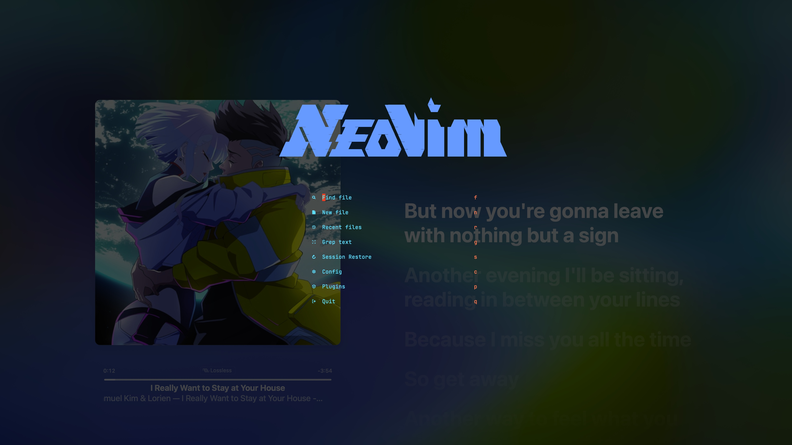

# Ray's Neovim Config



## References

### Repos

- [Kickstart](https://github.com/nvim-lua/kickstart.nvim/blob/6f6f38a6b5059787d8d92b313f6e1b2c722389b0/init.lua#L629)
  - [TJ](https://github.com/tjdevries/config.nvim)
- [LazyVim](https://github.com/LazyVim/LazyVim)
- [AstroVim](https://github.com/AstroNvim/AstroNvim)
  - [Astro Community](https://github.com/AstroNvim/AstroCommunity?tab=readme-ov-file)
- [LunarVim](https://github.com/lunarvim/lunarvim)
  - [Christian](https://github.com/ChristianChiarulli/nvim?tab=readme-ov-file)

### Articles

#### Collections

- [Ultimate Neovim Resource Repo](https://levelup.gitconnected.com/ultimate-neovim-resource-repo-7b5a32ba315f)

#### Python

- [LunarVim as a Python IDE](https://medium.com/better-programming/lunarvim-as-a-python-ide-ca8f57ca9f3a)

## 🛠️ Installation

### Backup your own config

```shell
mv ~/.config/nvim{,.bak}
mv ~/.local/share/nvim{,.bak}
mv ~/.local/state/nvim{,.bak}
mv ~/.cache/nvim{,.bak}
```

### Clone then activate plugins installation

```shell
git clone --depth 1 https://github.com/junrui-fang/nvim-config ~/.config/nvim
rm -rf ~/.config/nvim/.git
nvim
```
